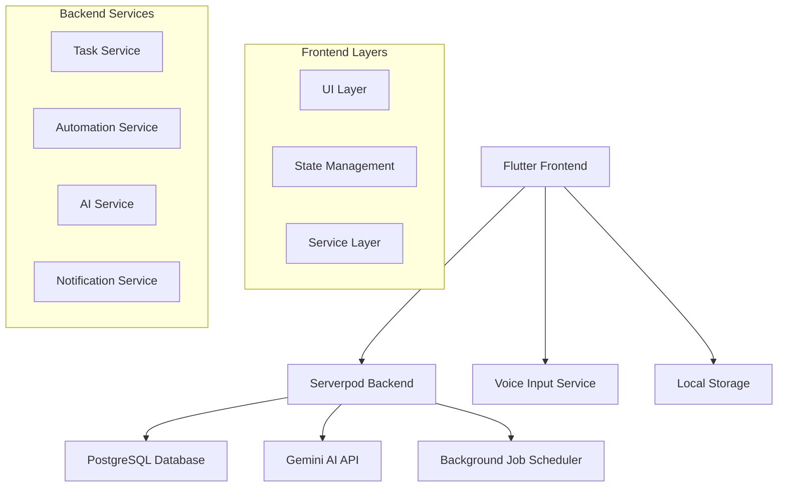
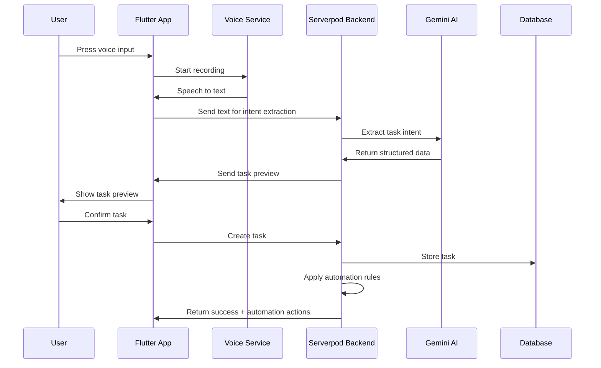

# Voice Butler Design Document

## Overview

Voice Butler is a Flutter-based mobile application with a Serverpod backend that provides intelligent voice-activated task management. The system architecture separates concerns between voice processing, AI intent extraction, task management, and automation execution. The application supports both a streamlined basic mode and an advanced mode for power users who want to create custom automation workflows.

The system follows a client-server architecture where the Flutter frontend handles user interaction and voice input, while the Serverpod backend manages data persistence, AI processing, background job scheduling, and automation rule execution.

## Architecture

### High-Level Architecture



### Component Interaction Flow



## Components and Interfaces

### Frontend Components

#### Voice Input Component
- **Responsibility**: Capture and process voice input
- **Interface**: 
  - `startRecording()`: Begin voice capture
  - `stopRecording()`: End capture and return text
  - `onSpeechResult(String text)`: Callback for processed speech

#### Task List Component
- **Responsibility**: Display and manage task collections
- **Interface**:
  - `displayTasks(List<Task> tasks)`: Render task list
  - `onTaskComplete(String taskId)`: Handle task completion
  - `onTaskDelete(String taskId)`: Handle task deletion

#### Advanced Mode Component
- **Responsibility**: Provide rule building and workflow management
- **Interface**:
  - `buildRule(RuleBuilder builder)`: Create custom automation rules
  - `applyPreset(WorkflowPreset preset)`: Apply predefined workflows
  - `validateRule(AutomationRule rule)`: Ensure rule validity

### Backend Services

#### Task Service
- **Responsibility**: CRUD operations for tasks and soft delete management
- **Interface**:
  - `createTask(TaskData data)`: Create new task
  - `updateTask(String id, TaskData data)`: Modify existing task
  - `softDeleteTask(String id)`: Move task to Recently Deleted
  - `restoreTask(String id)`: Recover soft-deleted task
  - `permanentDeleteTask(String id)`: Remove task permanently

#### Automation Service
- **Responsibility**: Execute automation rules and manage workflows
- **Interface**:
  - `applyAutomationRules(Task task)`: Execute applicable rules
  - `scheduleReminder(Task task, DateTime when)`: Set up notifications
  - `createCustomRule(RuleDefinition rule)`: Store user-defined rules
  - `executeWorkflowPreset(String presetId, Task task)`: Apply preset automation

#### AI Service
- **Responsibility**: Process natural language and extract structured data
- **Interface**:
  - `extractTaskIntent(String speechText)`: Convert speech to task data
  - `convertNaturalLanguageRule(String description)`: Create automation rules from text
  - `explainRuleEffects(AutomationRule rule)`: Provide rule explanations

## Data Models

### Task Model
```dart
class Task {
  String id;
  String title;
  TaskPriority priority; // LOW, MEDIUM, HIGH
  String? reason;
  DateTime? deadline;
  TaskStatus status; // PENDING, COMPLETED, SOFT_DELETED
  DateTime createdAt;
  DateTime? completedAt;
  DateTime? deletedAt;
}
```

### Automation Rule Model
```dart
class AutomationRule {
  String id;
  String name;
  RuleTrigger trigger; // TASK_CREATED, DEADLINE_APPROACHING, etc.
  List<RuleCondition> conditions;
  List<RuleAction> actions;
  bool isActive;
  DateTime createdAt;
}
```

### Activity Log Model
```dart
class ActivityLog {
  String id;
  String taskId;
  ActivityType type; // AUTOMATION_APPLIED, REMINDER_SENT, etc.
  String description;
  Map<String, dynamic> metadata;
  DateTime timestamp;
}
```

## Correctness Properties

*A property is a characteristic or behavior that should hold true across all valid executions of a system-essentially, a formal statement about what the system should do. Properties serve as the bridge between human-readable specifications and machine-verifiable correctness guarantees.*

### Property 1: Voice Input Processing Reliability
*For any* valid speech input, the voice processing system should either successfully convert it to text or provide a clear fallback mechanism, never leaving the user in an undefined state.
**Validates: Requirements 1.1, 1.5**

### Property 2: AI Intent Extraction Completeness
*For any* text input from speech conversion, the AI intent extraction should produce structured task data containing all required fields (title, priority, reason, optional deadline).
**Validates: Requirements 1.2**

### Property 3: Task Preview Accuracy
*For any* extracted task intent, the preview display should contain all the structured data fields from the intent extraction.
**Validates: Requirements 1.3**

### Property 4: Task Creation Consistency
*For any* confirmed task preview, creating the task should result in a stored task that matches the preview data exactly.
**Validates: Requirements 1.4**

### Property 5: Task List Display Completeness
*For any* collection of tasks, the task list should display all pending and completed tasks with their correct priority indicators.
**Validates: Requirements 2.1**

### Property 6: Task Completion State Transition
*For any* pending task, marking it as complete should update its status and move it to the completed section.
**Validates: Requirements 2.2**

### Property 7: Soft Delete Behavior
*For any* task that is deleted, it should be moved to Recently Deleted rather than permanently removed.
**Validates: Requirements 2.3**

### Property 8: Recently Deleted Display
*For any* collection of soft-deleted tasks, the Recently Deleted interface should display all tasks with restore and permanent delete options.
**Validates: Requirements 2.4**

### Property 9: Automatic Task Cleanup
*For any* soft-deleted task older than seven days, the system should automatically remove it permanently.
**Validates: Requirements 2.5**

### Property 10: Deadline Reminder Scheduling
*For any* task with a deadline, the system should automatically schedule appropriate reminder notifications.
**Validates: Requirements 3.1**

### Property 11: Priority-Based Automation
*For any* high-priority task, the system should apply early reminder automation rules.
**Validates: Requirements 3.2**

### Property 12: Automation Activity Logging
*For any* automation rule execution, all actions taken should be logged in the activity feed.
**Validates: Requirements 3.3**

### Property 13: Automation Notification
*For any* predefined automation execution, the user should be notified of the automated action taken.
**Validates: Requirements 3.4**

### Property 14: Automation Error Resilience
*For any* background automation failure, the system should log the failure and continue normal operation without interruption.
**Validates: Requirements 3.5**

### Property 15: Custom Rule Validation
*For any* custom automation rule created by a user, the system should validate the rule structure using trigger-condition-action patterns.
**Validates: Requirements 4.2**

### Property 16: Natural Language Rule Conversion
*For any* natural language rule description, the AI should convert it into a structured automation rule.
**Validates: Requirements 4.3**

### Property 17: Rule Effect Explanation
*For any* automation rule created or modified, the system should provide clear explanations of the rule's effects.
**Validates: Requirements 4.4**

### Property 18: Preset Workflow Execution
*For any* preset workflow applied, all bundled automation rules should execute and their actions should be logged.
**Validates: Requirements 4.5**

### Property 19: Automation Execution Logging
*For any* automation rule execution, detailed logs of all actions taken should be recorded.
**Validates: Requirements 5.1**

### Property 20: Activity Feed Chronological Display
*For any* collection of logged actions, the activity feed should display them in chronological order with timestamps.
**Validates: Requirements 5.2**

### Property 21: Automated Action Explanations
*For any* automated action that affects tasks, clear explanations of what was done and why should be provided.
**Validates: Requirements 5.3**

### Property 22: System Error Logging
*For any* system error during automation, error details should be logged and operation should continue.
**Validates: Requirements 5.4**

### Property 23: Activity Log Management
*For any* activity log collection that exceeds storage limits, older entries should be archived while maintaining recent history.
**Validates: Requirements 5.5**

### Property 24: Task Data Persistence
*For any* task creation or modification, changes should be immediately persisted to the backend database.
**Validates: Requirements 6.1**

### Property 25: Rule Configuration Persistence
*For any* automation rule configuration, rule definitions and execution schedules should be stored persistently.
**Validates: Requirements 6.2**

### Property 26: Application Restart Recovery
*For any* application restart, all tasks, rules, and scheduled automations should be restored from persistent storage.
**Validates: Requirements 6.3**

### Property 27: Data Corruption Recovery
*For any* detected data corruption, the system should attempt recovery and notify the user of any data loss.
**Validates: Requirements 6.4**

### Property 28: Background Job Reliability
*For any* scheduled background job, reliable execution should be ensured across application restarts.
**Validates: Requirements 6.5**

### Property 29: Advanced Mode Transition
*For any* Advanced Mode toggle, interface elements should transition without data loss.
**Validates: Requirements 7.3**

### Property 30: Navigation Error Recovery
*For any* navigation error, the system should gracefully handle the error and return to a stable state.
**Validates: Requirements 7.5**

## Error Handling

### Voice Input Errors
- **Speech Recognition Failure**: Provide manual text input fallback
- **Network Connectivity Issues**: Cache input locally and retry when connection restored
- **Microphone Permission Denied**: Guide user to enable permissions with clear instructions

### AI Processing Errors
- **Intent Extraction Failure**: Allow manual task field entry with AI suggestions
- **API Rate Limiting**: Implement exponential backoff and queue requests
- **Invalid AI Response**: Use structured fallback parsing with predefined patterns

### Data Persistence Errors
- **Database Connection Loss**: Queue operations locally and sync when connection restored
- **Storage Quota Exceeded**: Implement data cleanup policies and user notifications
- **Corruption Detection**: Attempt automatic recovery and provide manual backup options

### Automation Errors
- **Rule Execution Failure**: Log error details and continue with remaining rules
- **Scheduling Conflicts**: Prioritize rules by importance and resolve conflicts automatically
- **Invalid Rule Configuration**: Validate rules before activation and provide correction suggestions

## Testing Strategy

### Unit Testing Approach
The application will use Flutter's built-in testing framework for unit tests, focusing on:
- Individual component behavior verification
- Service layer method testing with mock dependencies
- Data model validation and serialization testing
- Error handling path verification

### Property-Based Testing Approach
Property-based testing will be implemented using the `test` package with custom generators to verify universal properties across all valid inputs. Each property-based test will run a minimum of 100 iterations to ensure comprehensive coverage.

**Property-Based Testing Requirements:**
- Each correctness property must be implemented by a single property-based test
- Tests must be tagged with comments referencing the design document property: `**Feature: voice-butler, Property {number}: {property_text}**`
- Custom generators will be created for Task, AutomationRule, and other domain objects
- Tests will focus on invariants, round-trip properties, and behavioral consistency

**Testing Framework Selection:**
- **Unit Tests**: Flutter test framework with mockito for dependency mocking
- **Property-Based Tests**: Dart test package with custom property testing utilities
- **Integration Tests**: Flutter integration test framework for end-to-end workflows

### Test Coverage Strategy
- **Core Logic**: 100% coverage of business logic in services and models
- **UI Components**: Focus on state management and user interaction flows
- **Error Scenarios**: Comprehensive testing of all identified error conditions
- **Property Validation**: All seven correctness properties implemented as executable tests